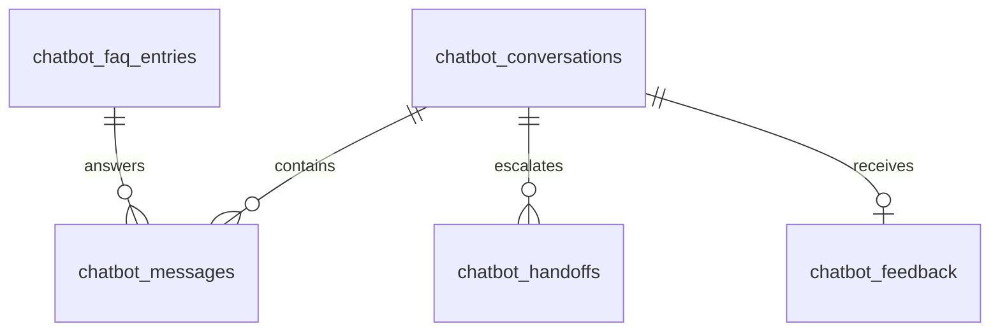

# Tablas necesarias para el modulo de chatbot

## Objetivo

Definir las tablas minimas necesarias para construir el modulo de chatbot de forma autonoma, sin depender de otros modulos como autenticacion, notificaciones, auditoria o citas.

## Principios de diseno

- El modulo debe poder operar por si solo.
- No se usan llaves foraneas hacia tablas externas.
- Las referencias a usuario o agente humano se guardan como identificadores opacos en texto.
- Las metricas basicas se pueden derivar desde conversaciones, mensajes y feedback.

## Resumen de tablas

| Tabla | Proposito |
| --- | --- |
| `chatbot_conversations` | Cabecera de cada sesion de conversacion. |
| `chatbot_messages` | Historial completo de mensajes entre usuario, bot y agente humano. |
| `chatbot_faq_entries` | Base de conocimiento inicial para respuestas guiadas y preguntas frecuentes. |
| `chatbot_handoffs` | Registro de escalamiento a atencion humana. |
| `chatbot_feedback` | Medicion de satisfaccion y resolucion por conversacion. |

## 1. Tabla `chatbot_conversations`

Guarda una conversacion desde que inicia hasta que termina.

### Campos

| Campo | Tipo sugerido | Requerido | Descripcion |
| --- | --- | --- | --- |
| `id` | `uuid` | Si | Identificador unico de la conversacion. |
| `channel` | `text` | Si | Canal de origen: `web`, `mobile`, `kiosk`, `whatsapp`. |
| `status` | `text` | Si | Estado: `active`, `resolved`, `abandoned`, `escalated`, `closed`. |
| `started_at` | `timestamptz` | Si | Fecha de inicio. |
| `ended_at` | `timestamptz` | No | Fecha de cierre. |
| `language` | `text` | Si | Idioma principal de la sesion. |
| `external_user_ref` | `text` | No | Identificador externo del usuario, sin FK a otro modulo. |
| `user_display_name` | `text` | No | Nombre visible del usuario si se conoce. |
| `current_topic` | `text` | No | Tema o categoria activa de la conversacion. |
| `resolution_type` | `text` | No | Resultado final: `faq`, `human`, `timeout`, `unresolved`. |
| `confidence_score` | `numeric(5,4)` | No | Nivel de confianza promedio del bot. |
| `message_count` | `integer` | Si | Total de mensajes acumulados. |
| `last_message_at` | `timestamptz` | No | Ultima actividad. |
| `metadata` | `jsonb` | No | Contexto adicional del flujo. |
| `created_at` | `timestamptz` | Si | Fecha de creacion. |
| `updated_at` | `timestamptz` | Si | Fecha de ultima actualizacion. |

### Reglas clave

- `message_count` inicia en `0`.
- `status` y `resolution_type` deben validarse con `CHECK`.
- `ended_at` solo debe existir cuando la conversacion ya no este activa.

### Indices recomendados

- `idx_chatbot_conversations_status`
- `idx_chatbot_conversations_started_at`
- `idx_chatbot_conversations_external_user_ref`
- `idx_chatbot_conversations_last_message_at`

## 2. Tabla `chatbot_messages`

Registra cada mensaje enviado o recibido dentro de una conversacion.

### Campos

| Campo | Tipo sugerido | Requerido | Descripcion |
| --- | --- | --- | --- |
| `id` | `uuid` | Si | Identificador unico del mensaje. |
| `conversation_id` | `uuid` | Si | Conversacion a la que pertenece. |
| `sender_type` | `text` | Si | Emisor: `user`, `bot`, `agent`, `system`. |
| `sender_ref` | `text` | No | Identificador externo del emisor. |
| `message_type` | `text` | Si | Tipo: `text`, `quick_reply`, `card`, `system_event`. |
| `content` | `text` | Si | Contenido principal del mensaje. |
| `intent_detected` | `text` | No | Intencion detectada por el bot. |
| `faq_entry_id` | `uuid` | No | FAQ usada para responder, si aplica. |
| `confidence_score` | `numeric(5,4)` | No | Confianza de clasificacion del mensaje. |
| `is_escalation_trigger` | `boolean` | Si | Marca si este mensaje disparo escalamiento. |
| `payload` | `jsonb` | No | Botones, opciones, tarjetas o datos estructurados. |
| `created_at` | `timestamptz` | Si | Fecha de creacion. |

### Reglas clave

- `conversation_id` referencia solo a `chatbot_conversations(id)`.
- `faq_entry_id` referencia a `chatbot_faq_entries(id)`.
- `payload` permite soportar UI conversacional sin agregar mas tablas prematuramente.

### Indices recomendados

- `idx_chatbot_messages_conversation_id_created_at`
- `idx_chatbot_messages_sender_type`
- `idx_chatbot_messages_intent_detected`
- `idx_chatbot_messages_faq_entry_id`

## 3. Tabla `chatbot_faq_entries`

Representa la base de conocimiento inicial del chatbot.

### Campos

| Campo | Tipo sugerido | Requerido | Descripcion |
| --- | --- | --- | --- |
| `id` | `uuid` | Si | Identificador unico de la entrada FAQ. |
| `category` | `text` | Si | Categoria funcional: `tramites`, `pagos`, `horarios`, `justificaciones`. |
| `question` | `text` | Si | Pregunta canonicamente definida. |
| `answer` | `text` | Si | Respuesta oficial que devolvera el bot. |
| `keywords` | `text[]` | No | Palabras clave para matching simple. |
| `priority` | `integer` | Si | Orden de preferencia cuando hay coincidencias. |
| `status` | `text` | Si | Estado: `draft`, `published`, `archived`. |
| `source` | `text` | No | Fuente de negocio o documento base. |
| `requires_handoff` | `boolean` | Si | Indica si debe sugerir atencion humana. |
| `version` | `integer` | Si | Control simple de version. |
| `created_at` | `timestamptz` | Si | Fecha de creacion. |
| `updated_at` | `timestamptz` | Si | Fecha de actualizacion. |

### Reglas clave

- Debe existir al menos una forma de publicar o archivar respuestas.
- `priority` ayuda a resolver ambiguedades sin requerir motor ML.
- `requires_handoff` sirve para casos que el bot no debe resolver solo.

### Indices recomendados

- `idx_chatbot_faq_entries_category`
- `idx_chatbot_faq_entries_status`
- `idx_chatbot_faq_entries_priority`
- Indice GIN sobre `keywords`

## 4. Tabla `chatbot_handoffs`

Registra cada escalamiento desde el bot hacia atencion humana.

### Campos

| Campo | Tipo sugerido | Requerido | Descripcion |
| --- | --- | --- | --- |
| `id` | `uuid` | Si | Identificador del escalamiento. |
| `conversation_id` | `uuid` | Si | Conversacion escalada. |
| `trigger_message_id` | `uuid` | No | Mensaje que disparo el escalamiento. |
| `reason` | `text` | Si | Motivo: `low_confidence`, `user_request`, `policy_case`, `no_match`. |
| `status` | `text` | Si | Estado: `pending`, `assigned`, `resolved`, `cancelled`. |
| `priority` | `text` | Si | Prioridad: `low`, `medium`, `high`, `urgent`. |
| `assigned_agent_ref` | `text` | No | Identificador externo del agente humano. |
| `notes` | `text` | No | Observaciones del escalamiento. |
| `requested_at` | `timestamptz` | Si | Fecha de solicitud. |
| `resolved_at` | `timestamptz` | No | Fecha de resolucion. |
| `created_at` | `timestamptz` | Si | Fecha de creacion. |
| `updated_at` | `timestamptz` | Si | Fecha de actualizacion. |

### Reglas clave

- Puede haber multiples escalaciones en una misma conversacion, pero solo una `pending` o `assigned` al mismo tiempo.
- `assigned_agent_ref` no depende de una tabla de personal mientras el modulo sea autonomo.

### Indices recomendados

- `idx_chatbot_handoffs_conversation_id`
- `idx_chatbot_handoffs_status`
- `idx_chatbot_handoffs_requested_at`
- `idx_chatbot_handoffs_assigned_agent_ref`

## 5. Tabla `chatbot_feedback`

Permite medir satisfaccion, resolucion y calidad percibida.

### Campos

| Campo | Tipo sugerido | Requerido | Descripcion |
| --- | --- | --- | --- |
| `id` | `uuid` | Si | Identificador del feedback. |
| `conversation_id` | `uuid` | Si | Conversacion evaluada. |
| `rating` | `integer` | Si | Calificacion de 1 a 5. |
| `resolved` | `boolean` | Si | Indica si el usuario considera resuelto su caso. |
| `comment` | `text` | No | Comentario libre del usuario. |
| `submitted_by_ref` | `text` | No | Identificador externo del evaluador. |
| `submitted_at` | `timestamptz` | Si | Fecha de envio. |
| `created_at` | `timestamptz` | Si | Fecha de creacion tecnica. |

### Reglas clave

- Debe existir maximo un feedback final por conversacion si el flujo es simple.
- `rating` debe validarse con `CHECK (rating BETWEEN 1 AND 5)`.

### Indices recomendados

- `idx_chatbot_feedback_conversation_id`
- `idx_chatbot_feedback_rating`
- `idx_chatbot_feedback_submitted_at`

## Relaciones entre tablas



## Orden recomendado de creacion

1. `chatbot_conversations`
2. `chatbot_faq_entries`
3. `chatbot_messages`
4. `chatbot_handoffs`
5. `chatbot_feedback`

## Campos que intencionalmente no dependen de otros modulos

- `external_user_ref`
- `sender_ref`
- `assigned_agent_ref`
- `submitted_by_ref`

Estos campos permiten integracion futura con autenticacion o recursos humanos, pero hoy mantienen al chatbot desacoplado.

## SQL base sugerido

```sql
CREATE TABLE IF NOT EXISTS public.chatbot_conversations (
  id uuid PRIMARY KEY DEFAULT gen_random_uuid(),
  channel text NOT NULL,
  status text NOT NULL,
  started_at timestamptz NOT NULL DEFAULT now(),
  ended_at timestamptz,
  language text NOT NULL DEFAULT 'es',
  external_user_ref text,
  user_display_name text,
  current_topic text,
  resolution_type text,
  confidence_score numeric(5,4),
  message_count integer NOT NULL DEFAULT 0,
  last_message_at timestamptz,
  metadata jsonb,
  created_at timestamptz NOT NULL DEFAULT now(),
  updated_at timestamptz NOT NULL DEFAULT now(),
  CONSTRAINT chatbot_conversations_status_check
    CHECK (status IN ('active', 'resolved', 'abandoned', 'escalated', 'closed')),
  CONSTRAINT chatbot_conversations_resolution_check
    CHECK (resolution_type IS NULL OR resolution_type IN ('faq', 'human', 'timeout', 'unresolved'))
);

CREATE TABLE IF NOT EXISTS public.chatbot_faq_entries (
  id uuid PRIMARY KEY DEFAULT gen_random_uuid(),
  category text NOT NULL,
  question text NOT NULL,
  answer text NOT NULL,
  keywords text[],
  priority integer NOT NULL DEFAULT 100,
  status text NOT NULL DEFAULT 'draft',
  source text,
  requires_handoff boolean NOT NULL DEFAULT false,
  version integer NOT NULL DEFAULT 1,
  created_at timestamptz NOT NULL DEFAULT now(),
  updated_at timestamptz NOT NULL DEFAULT now(),
  CONSTRAINT chatbot_faq_entries_status_check
    CHECK (status IN ('draft', 'published', 'archived'))
);

CREATE TABLE IF NOT EXISTS public.chatbot_messages (
  id uuid PRIMARY KEY DEFAULT gen_random_uuid(),
  conversation_id uuid NOT NULL REFERENCES public.chatbot_conversations(id) ON DELETE CASCADE,
  sender_type text NOT NULL,
  sender_ref text,
  message_type text NOT NULL DEFAULT 'text',
  content text NOT NULL,
  intent_detected text,
  faq_entry_id uuid REFERENCES public.chatbot_faq_entries(id) ON DELETE SET NULL,
  confidence_score numeric(5,4),
  is_escalation_trigger boolean NOT NULL DEFAULT false,
  payload jsonb,
  created_at timestamptz NOT NULL DEFAULT now(),
  CONSTRAINT chatbot_messages_sender_type_check
    CHECK (sender_type IN ('user', 'bot', 'agent', 'system')),
  CONSTRAINT chatbot_messages_type_check
    CHECK (message_type IN ('text', 'quick_reply', 'card', 'system_event'))
);

CREATE TABLE IF NOT EXISTS public.chatbot_handoffs (
  id uuid PRIMARY KEY DEFAULT gen_random_uuid(),
  conversation_id uuid NOT NULL REFERENCES public.chatbot_conversations(id) ON DELETE CASCADE,
  trigger_message_id uuid REFERENCES public.chatbot_messages(id) ON DELETE SET NULL,
  reason text NOT NULL,
  status text NOT NULL DEFAULT 'pending',
  priority text NOT NULL DEFAULT 'medium',
  assigned_agent_ref text,
  notes text,
  requested_at timestamptz NOT NULL DEFAULT now(),
  resolved_at timestamptz,
  created_at timestamptz NOT NULL DEFAULT now(),
  updated_at timestamptz NOT NULL DEFAULT now(),
  CONSTRAINT chatbot_handoffs_reason_check
    CHECK (reason IN ('low_confidence', 'user_request', 'policy_case', 'no_match')),
  CONSTRAINT chatbot_handoffs_status_check
    CHECK (status IN ('pending', 'assigned', 'resolved', 'cancelled')),
  CONSTRAINT chatbot_handoffs_priority_check
    CHECK (priority IN ('low', 'medium', 'high', 'urgent'))
);

CREATE TABLE IF NOT EXISTS public.chatbot_feedback (
  id uuid PRIMARY KEY DEFAULT gen_random_uuid(),
  conversation_id uuid NOT NULL REFERENCES public.chatbot_conversations(id) ON DELETE CASCADE,
  rating integer NOT NULL,
  resolved boolean NOT NULL,
  comment text,
  submitted_by_ref text,
  submitted_at timestamptz NOT NULL DEFAULT now(),
  created_at timestamptz NOT NULL DEFAULT now(),
  CONSTRAINT chatbot_feedback_rating_check CHECK (rating BETWEEN 1 AND 5)
);
```

## Conclusiones

Con estas cinco tablas el modulo puede cubrir los entregables documentados hoy:

- interfaz conversacional
- preguntas frecuentes guiadas
- escalamiento a humano
- registro de conversaciones
- metricas basicas de uso y resolucion

Si despues quieren una version con migracion SQL lista para Supabase, el siguiente paso natural es convertir este documento en un archivo dentro de `supabase/migrations/`.