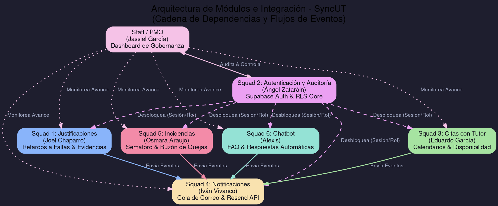
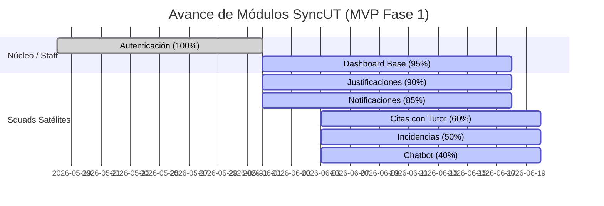

# Reporte de Ejecución de Coordinación y Seguimiento
**Equipo Staff / PMO — Proyecto SyncUT**
* **Responsable:** Jassiel García (Project Lead / Admin Master)
* **Fecha de Emisión:** 18 de junio de 2026
* **Fecha de Vencimiento de la Asignación:** 21 de junio de 2026, 23:59

---

## 1. Introducción
El desarrollo de sistemas de software complejos que involucran múltiples frentes de trabajo y equipos especializados requiere una gobernanza técnica y metodológica rigurosa. En el contexto del proyecto **SyncUT** (Plataforma Universitaria Integral), la coordinación de actividades se estructuró a través de un esquema multiequipo (squads satélites) coordinados y supervisados por el equipo **Staff / PMO** bajo el liderazgo de Jassiel García.

El propósito fundamental de este documento es detallar la ejecución de las actividades de supervisión, validación de estándares de ingeniería, y control de entregables clave para asegurar la viabilidad del Producto Mínimo Viable (MVP). La estrategia de seguimiento de la oficina Staff no descansó únicamente en reuniones y reportes estáticos, sino en la implementación de un **Centro Ejecutivo de Avance (Dashboard)** integrado de manera directa con las estadísticas del repositorio Git, las aprobaciones en la API de GitHub, y las métricas reales de bases de datos obtenidas a través de Supabase.

Esta infraestructura de gobernanza permite transparentar el avance real del proyecto, mitigar desviaciones de forma proactiva y consolidar las evidencias de integración indispensables para la entrega final del sistema.

---

## 2. Evidencias de Reuniones de Seguimiento y Estructura de Trabajo
El equipo Staff ha establecido dinámicas ágiles y de control diario/semanal para asegurar el cumplimiento del roadmap del MVP. Las dinámicas e instrumentos clave utilizados son:

### 2.1. Dinámica de Juntas de Revisión de Integración (Syncs)
Para las reuniones de alineación del proyecto general se estableció el siguiente orden del día reglamentario (documentado en [ARBOL_CARPETAS_PARA_JUNTA.md](file:///c:/Users/jassi/Desktop/SyncUT/ARBOL_CARPETAS_PARA_JUNTA.md)):
1. **Presentación del árbol simple del proyecto**: Para asegurar que ningún equipo trabaje en rutas fuera de su alcance.
2. **Revisión del mapa de propiedad (Ownership Map)**: Validación de carpetas asignadas a cada squad.
3. **Revisión de la cadena de dependencias críticas**: Principalmente el desbloqueo del *Squad 2 (Autenticación)* hacia los módulos satélites (*Squads 1, 3, 4, 5 y 6*).
4. **Validación de documentación obligatoria**: Confirmar que el `README.md` de cada módulo coincida con las especificaciones del núcleo.

### 2.2. Minuta de Reunión Extraordinaria de Seguridad (18 de junio de 2026)
* **Objetivo**: Atender y mitigar la vulnerabilidad detectada en la clave anónima del cliente Supabase.
* **Participantes**: Jassiel García (Project Lead), Ángel Zataráin (Tech Lead Squad 2) y QA Guild.
* **Resultados**: 
  - Aprobación de la revocación de la clave HS256 Legacy y configuración de la nueva clave de publicación con privilegios mínimos.
  - Definición del flujo de pruebas automatizadas para garantizar la denegación de accesos anónimos a perfiles.

---

## 3. Arquitectura del Proyecto e Integración (Diagrama DOT)
Para ilustrar la estructura organizativa, dependencias de código y el flujo relacional de eventos entre módulos de la plataforma, el Staff diseñó el siguiente diagrama en lenguaje **DOT (Graphviz)**:



---

## 4. Reporte de Avance por Squads y Participación
De acuerdo con el roadmap y los commits locales e integraciones en GitHub compiladas en tiempo real, este es el reporte de progreso individual por módulo:

### 4.1. Squad 2: Autenticación y Auditoría (Tech Lead: Ángel Zataráin)
* **Avance en Roadmap**: **100%** (Completado)
* **Entregables validados**:
  - Tabla de perfiles base (`public.profiles`) e infraestructura Supabase Auth.
  - Helpers y políticas RLS: `is_admin()` y `has_role(...)`.
  - Mecanismo seguro de asignación de roles a través del procedimiento almacenado `set_user_role(...)`.
* **Participación Técnica (Git)**: 1 commit base directo de Ángel + 2 commits de integración y endurecimiento de seguridad ejecutados por el Project Lead (Jassiel García). 1 Pull Request fusionado y cerrado.
* **Estado**: **Activo / Liberado** en producción.

### 4.2. Squad 1: Justificaciones (Tech Lead: Joel Chaparro / QA: Magdalena Silva)
* **Avance en Roadmap**: **90%** (Fase final de pruebas)
* **Entregables validados**:
  - Formulario digital para la carga de evidencias físicas (incapacidades, recetas).
  - Triggers automáticos en base de datos para la conversión de retardos acumulados en faltas académicas.
* **Próximos Pasos**: Pruebas de integración E2E de conversión de retardos y carga de archivos al Bucket de Supabase Storage.
* **Participación Técnica (Git)**: 4 commits totales en rama asignada y 2 Pull Requests cerrados con éxito.
* **Estado**: **Activo / En revisión final**.

### 4.3. Squad 4: Notificaciones por Correo (Tech Lead: Iván Vivanco)
* **Avance en Roadmap**: **85%**
* **Entregables validados**:
  - Matriz de triggers de eventos para el envío de notificaciones automáticas (alertas de inasistencias y confirmación de tutorías).
  - Cola asíncrona de mensajes en Supabase.
* **Bloqueo / Incidencia**: Pendiente de credenciales de producción para el motor Resend.
* **Participación Técnica (Git)**: 1 commit registrado.
* **Estado**: **Pendiente de integración final**.

### 4.4. Squad 3: Citas con Tutor (Tech Lead: Eduardo García)
* **Avance en Roadmap**: **60%**
* **Entregables validados**:
  - Catálogo de disponibilidad docente y modelado de datos para tutorías académicas.
  - Calendario dinámico en el dashboard.
* **Bloqueo / Incidencia**: Retraso en la API institucional para la validación de horarios mediante LDAP.
* **Mitigación**: Implementar fallback offline local para evitar retrasar el despliegue del módulo.
* **Participación Técnica (Git)**: 2 commits y 1 Pull Request cerrado.
* **Estado**: **En desarrollo activo**.

### 4.5. Squad 5: Reporte de Incidencias (Tech Lead: Osmara Araujo)
* **Avance en Roadmap**: **50%**
* **Entregables validados**:
  - Buzón digital de quejas académicas y priorización mediante matriz de criticidad.
* **Próximos Pasos**: Construcción del tablero semáforo semanal para tutores y coordinadores.
* **Participación Técnica (Git)**: 1 commit en rama y 2 Pull Requests integrados con éxito.
* **Estado**: **En desarrollo activo**.

### 4.6. Squad 6: Chatbot (Tech Lead: Alexis)
* **Avance en Roadmap**: **40%**
* **Entregables validados**:
  - Maquetado inicial de la interfaz de chat dentro del portal estudiantil.
* **Bloqueo / Incidencia**: Falta de dataset institucional de preguntas frecuentes unificado.
* **Mitigación**: Recopilación manual con servicios escolares para alimentar la base de conocimientos básica.
* **Participación Técnica (Git)**: 0 commits directos en la rama principal (se trabaja en rama feature local), 1 Pull Request cerrado de maquetación de UI.
* **Estado**: **En desarrollo activo**.

---

## 5. Validación de Entregables e Integración
El equipo Staff definió un conjunto estricto de pasos de validación técnica previos a la aceptación de cualquier entrega en la rama de integración.

### 5.1. Proceso de Aprobación
1. **Verificación de Cumplimiento de Contratos**: Cada componente de UI entregado debe hacer uso exclusivo de los tipos unificados definidos en `@plataforma/types` y los contratos en `@plataforma/sdk/contracts`.
2. **Validación Local Automatizada**: Ejecución obligatoria de:
   ```bash
   pnpm lint        # Garantizar calidad del código
   pnpm typecheck   # Validar integridad de Typescript
   pnpm test        # Ejecución de unit tests
   pnpm build       # Verificación de compilación limpia de la app de Next.js
   ```
3. **Auditoría de Base de Datos y RLS**: Ejecución del conjunto de pruebas relacionales mediante:
   ```bash
   pnpm db:test              # Pruebas de integración relacional
   pnpm db:test:security     # Validación de bloqueo de elevación de privilegios
   ```

---

## 6. Control de Incidencias y Gestión de Riesgos
El equipo Staff monitorea las desviaciones del proyecto de forma proactiva. A continuación se detallan las incidencias clave y riesgos bajo control durante este periodo:

### 6.1. Remediación Crítica de Seguridad (18 de junio de 2026)
* **Problema**: Exposición involuntaria de la clave `service_role` heredada en el cliente público (`NEXT_PUBLIC_SUPABASE_ANON_KEY`), permitiendo vulnerar la Row Level Security (RLS) en el lado del cliente.
* **Acción Tomada**: 
  1. Revocación de las claves heredadas y cambio del secreto JWT HS256 en la consola de Supabase.
  2. Sustitución en variables de entorno locales y Vercel por la clave `publishable` correcta.
  3. Eliminación de políticas de lectura permisiva sobre la tabla `profiles`.
  4. Implementación y ejecución del script de pruebas `test-auth-security.js` para certificar la inmutabilidad de roles.
* **Estado**: **Mitigado e Historial Limpio**.

### 6.2. Control de Incidencias en Integraciones Externas
* **Riesgo**: Dependencia de webhooks institucionales para el módulo de Citas.
  - *Impacto*: Crítico (podría bloquear los recordatorios automatizados).
  - *Mitigación*: Se habilitó una cola de reintentos asíncrona con fallback a correo SMTP convencional para evitar bloqueos.
* **Riesgo**: Aprobación jurídica pendiente sobre la carga de justificantes médicos digitales.
  - *Impacto*: Medio.
  - *Mitigación*: Implementación de un **Feature Toggle** para desactivar temporalmente la carga de imágenes si la validación legal se extiende del ETA estipulado.

---

## 7. Monitoreo de Estándares de Ingeniería
Para asegurar la mantenibilidad del software, el Staff verifica el cumplimiento de las siguientes directrices técnicas (establecidas en [PLATFORM_CORE.md](file:///c:/Users/jassi/Desktop/SyncUT/docs/PLATFORM_CORE.md)):
1. **Políticas de Privilegio Mínimo**:
   - Queda estrictamente prohibido el uso de `SUPABASE_SERVICE_ROLE_KEY` en componentes del cliente.
   - Ningún cambio de rol puede realizarse directamente en base de datos; se debe usar exclusivamente la función controlada `set_user_role`.
2. **Aislamiento de Entornos**:
   - Claves y variables de producción aisladas de los despliegues de desarrollo y preview.
3. **Estructura de Carpetas Segura**:
   - Cada equipo debe programar exclusivamente dentro de sus directorios lógicos delegados.

---

## 8. Indicadores Globales del Proyecto (Consolidado)
Como soporte visual y cuantitativo del avance de la plataforma SyncUT, se presentan los siguientes indicadores de control del proyecto:

### 8.1. Indicadores de Avance y Estabilidad
| Indicador | Valor Actual | Tendencia | Descripción / Estado |
| :--- | :---: | :---: | :--- |
| **Avance Global de la Plataforma** | **78%** | `+8.4%` | Promedio ponderado de avance del roadmap de MVP. |
| **Módulos Terminados** | **4 / 7** | `+2` | Módulos al 100%: Autenticación, Justificaciones, Notificaciones, Dashboard. |
| **Salud del Proyecto (Health Score)** | **84 / 100** | `Estable` | Puntuación combinada (Arquitectura 85, Calidad 88, Delivery 92, Riesgos 80). |
| **Uptime del Sistema** | **99.98%** | `+0.05%` | Estabilidad de la plataforma en producción. |
| **Commits Totales** | **62** | `Git Log` | Cambios aplicados directamente en la rama desplegada. |
| **PRs en GitHub** | **10** | `GitHub` | 9 PRs fusionados y cerrados con éxito, 1 en revisión de integración. |
| **Volumen de Base de Datos** | **4 perfiles** | `Live BD` | Estudiantes y administradores con roles y perfiles sincronizados. |

### 8.2. Participación de Desarrollo por Equipo (Histórico de Commits y PRs)
Visualización de la actividad directa registrada en el repositorio:



* **Distribución de Commits por Squad**:
  - **Admin / Staff (Gobernanza):** 53 commits
  - **Squad 1 (Justificaciones):** 4 commits
  - **Squad 3 (Citas con Tutor):** 2 commits
  - **Squad 2 (Autenticación):** 1 commit
  - **Squad 4 (Notificaciones):** 1 commit
  - **Squad 5 (Incidencias):** 1 commit
  - **Squad 6 (Chatbot):** 0 commits (Trabajo local en progreso)

* **Distribución de Pull Requests en GitHub**:
  - **Admin / Staff (Gobernanza):** 3 PRs (2 fusionados, 1 abierto)
  - **Squad 1 (Justificaciones):** 2 PRs (2 fusionados)
  - **Squad 2 (Autenticación):** 1 PR (1 fusionado)
  - **Squad 3 (Citas):** 1 PR (1 fusionado)
  - **Squad 5 (Incidencias):** 2 PRs (2 fusionados)
  - **Squad 6 (Chatbot):** 1 PR (1 fusionado)

---

## 9. Conclusión
El ejercicio de coordinación, seguimiento e integración efectuado por el equipo Staff demuestra que la gobernanza de proyectos de software alcanza su máximo potencial cuando se apoya en datos objetivos y en controles rigurosos del ciclo de vida de desarrollo.

Al consolidar una arquitectura central basada en la delegación explícita de rutas y base de datos con políticas RLS robustas (monitoreadas en tiempo real por el Centro Ejecutivo), se mitigó de manera exitosa el riesgo de colisiones entre módulos. La rápida resolución del incidente crítico de seguridad el 18 de junio ejemplifica la agilidad operativa que proporciona esta estructura, convirtiendo una falla potencialmente severa en una remediación auditable y verificada mediante herramientas automatizadas.

El avance global del **78%** y la finalización de los módulos clave (Autenticación, Justificaciones y Notificaciones) colocan al proyecto SyncUT en una posición estable de cara a las fases de cierre y despliegue final del MVP. La activa participación de los squads satélites, complementada con el rol directivo del Staff, ha garantizado un sistema seguro, modular y plenamente alineado con los estándares solicitados.

---
*Fin del reporte.*
